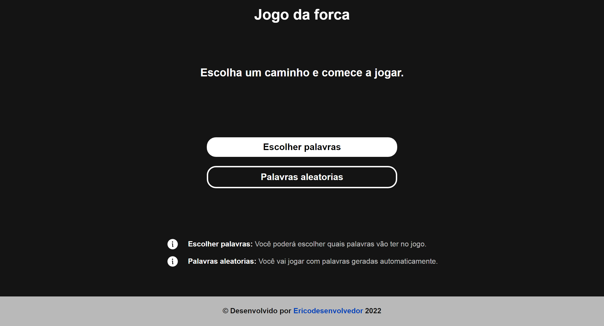

# Jogo da forca

> Challege alura #2

Neste desafio foi feito um jogo da forca, com 5 telas diferentes interativas, onde você pode jogar com palavras selecionadas por você ou jogar com palavras padrões definidas pelo projeto.

[acesse por aqui o site]()

## ⚒️ Ferramentas

- Html
- Css
- Javascript
- Git e Github

## Desafios

- Adicionar telas interativas.
- Caminhos escolhidos pelo jogador [Escolher palavras e palavras aleatorias].
- Controle de ganhou ou perdeu.